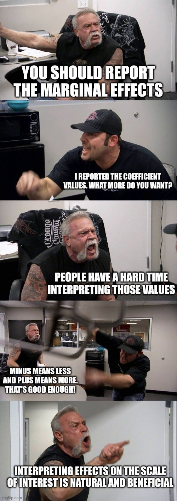
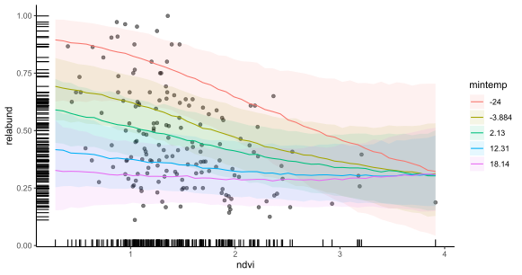
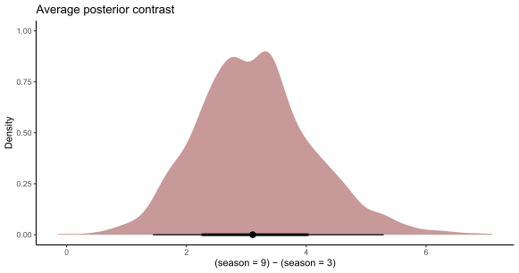

```{r setup, include=FALSE, cache=FALSE}
options(htmltools.dir.version = FALSE)
knitr::opts_chunk$set(cache = FALSE, dev = 'svg', echo = TRUE,
                      message = FALSE, warning = FALSE,
                      fig.align = 'center',
                      fig.height = 5.1, fig.width = 1.9 * 5.1)
library('mgcv')
library('mvgam')
library('forecast')
library('gamair')
library('ggplot2')
library('viridis')
library('fontawesome')
library('gratia')
library('ggborderline')
library('kableExtra')
theme_set(theme_bw(base_size = 12, base_family = 'serif'))
options(ggplot2.discrete.colour = c("#B97C7C",
                              "#A25050",
                              "#8F2727",
                              "#630000"),
        ggplot2.discrete.fill = c("#B97C7C",
                            "#A25050",
                            "#8F2727",
                            "#630000"))
```

```{r xaringan-panelset, echo=FALSE}
xaringanExtra::use_panelset()
xaringanExtra::style_panelset_tabs(foreground = '#8F2727',
                                   inactive_opacity = 0.8)
```

```{r xaringan-animate-css, echo=FALSE}
xaringanExtra::use_animate_css()
```

```{r xaringanExtra-clipboard, echo=FALSE}
xaringanExtra::use_clipboard()
```

```{r xaringan-tile, echo=FALSE}
xaringanExtra::use_tile_view()
```

```{r setup II, echo = FALSE}
c_light <- c("#DCBCBC")
c_light_highlight <- c("#C79999")
c_mid <- c("#B97C7C")
c_mid_highlight <- c("#A25050")
c_dark <- c("#8F2727")
c_dark_highlight <- c("#7C0000")

multipar = function(...){
  par(family = "serif", 
    bty = "l", 
    cex.axis = 1.1, 
    cex.lab = 1.1, 
    cex.main = 1.3,
    xaxs = 'r',
    yaxs = 'r',
    pch = 16)
}

mypar = function(...){
  par(family = "serif", 
      las = 1, 
      mar=c(4,4.1,2,2),
      mgp = c(2,0.5,0),
      bty = "l", 
      cex.axis = 1.25, 
      cex.lab = 1.5, 
      cex.main = 1.5,
      xaxs = 'r',
      yaxs = 'r',
      pch = 16)
}

myparsmall = function(...){
  par(family = "serif", 
      las = 1, 
      mgp = c(4, 1, 0),
      mar=c(5,6,2,2),
      bty = "l", 
      cex.axis = 1.85, 
      cex.lab = 2.75, 
      cex.main = 2.75,
      xaxs = 'r',
      yaxs = 'r',
      pch = 16)
}

myhist = function(x, 
                  xlim,
                  xlab = '',
                  main = '',
                  big = TRUE){

  if(big){
      mypar()
  } else {
      myparsmall()
  }

  if(missing(xlim)){
    xlim <- range(x, na.rm = TRUE)
  }
  
  hist(x, 
       xlim = xlim,
       yaxt = 'n',
       xlab = xlab,
       ylab = '',
       col = c_mid_highlight,
       border = 'white',
       lwd = 2,
       breaks = 20,
       main = main)
}

mybar = function(x, 
                  xlab = '',
                  main = '',
                  big = TRUE){

  if(big){
      mypar()
  } else {
      myparsmall()
  }
  
  barplot(table(x),
          yaxt = 'n',
          xlab = xlab,
          border = NA,
       ylab = '',
       col = c_mid_highlight,
       lwd = 2,
       main = main)
  axis(1, labels = NA, tck=0, lwd =2)
}

mylines = function(x, xlab = '', 
                   ylim,
                   ylab = '',
                   big = TRUE){

  if(big){
      mypar()
  } else {
      myparsmall()
  }
  
  if(missing(ylim)){
      plot(x = x, 
       type = 'l',
       col = c_dark_highlight,
       lwd = 3.5,
       bty = 'l',
       xlab = xlab,
       ylab = ylab)
  } else {
      plot(x = x, 
       ylim = ylim,
       type = 'l',
       col = c_dark_highlight,
       lwd = 3.5,
       bty = 'l',
       xlab = xlab,
       ylab = ylab)
  }

  box(bty = 'l', lwd = 2)
}

myscatter = function(x, 
                     y, 
                     xlab = '', 
                     ylab = '', 
                     big = TRUE){
  
    if(big){
      mypar()
  } else {
      myparsmall()
  }

  plot(x = x, 
       y = y, 
       pch = 21,
       bg = c_dark,
       col = 'white',
       cex = 2,
       bty = 'l',
       xlab = xlab,
       ylab = ylab)
  box(bty = 'l', lwd = 2)
}
```


## About me


ARC Discovery Early Career Fellow

The University of Queensland
- School of Veterinary Science 
- Located in Gatton, Australia


Interested in:
- Quantitative ecology
- Molecular genetics
- Multivariate time series modelling

---

class: middle center
###“Because all decision making is based on what will happen in the future, either under the status quo or different decision alternatives, decision making ultimately depends on forecasts”
  
[Dietze et al. 2018](https://ecoforecast.org/about/)

---

background-image: url('./resources/big_data.gif')
background-size: contain
background-color: #F2F2F2

---

class: middle center

### Can we use common time series models in ecology?

---

## *Very* easy to apply in `r fa("r-project", fill = "steelblue")`


Hyndman’s tools in the [`forecast` 📦](https://pkg.robjhyndman.com/forecast/) are hugely popular and accessible for time series analysis / forecasting 
  
[ETS](https://pkg.robjhyndman.com/forecast/reference/ets.html) handles many types of seasonality and nonlinear trends 
  
[Regression with ARIMA errors](https://pkg.robjhyndman.com/forecast/reference/auto.arima.html) includes additive effects of predictors while capturing trends and seasonality

*Some* of these algorithms can handle missing data

*All* are fast to fit and forecast, but assume observations are *Gaussian*

---

class: middle center
### But most real-world ecological observations, including time series, *are not Gaussian*

---

```{r echo = FALSE, fig.cap = "Properties of lunar monthly Desert Pocket Mouse capture time series from a long-term monitoring study in Portal, Arizona, USA"}
multipar()
portal_data %>%
  dplyr::mutate(time = moon - (min(moon)) + 1) %>%
  dplyr::mutate(count = PP) %>%
  dplyr::mutate(series = as.factor('PP')) %>%
  dplyr::select(series, year, time, count, mintemp, ndvi) -> model_data
plot_mvgam_series(data = model_data, y = 'count')
```

---

```{r echo = FALSE, fig.cap = "Properties of annual American kestrel abundance time series in British Columbia, Canada"}
load(url('https://github.com/atsa-es/MARSS/raw/master/data/kestrel.rda'))
multipar()
model_data = data.frame(time = 1:NROW(kestrel),
                        series = as.factor('kestrel'),
                        count = exp(kestrel[,2]))
plot_mvgam_series(data = model_data, y = 'count')
```

---

class: middle center
###“If our data contains small counts (0,1,2,...), then we need to use forecasting methods that are more appropriate for a sample space of non-negative integers. 
<br>
### *Such models are beyond the scope of this book*”
  
[Hyndman and Athanasopoulos, Forecasting Principles and Practice](https://otexts.com/fpp3/counts.html)

---
class: black-inverse
.center[.grey[.big[Ok. So now what?]]]


---

# Poisson GLM for counts?
A Poisson GLM models the conditional mean with a $log$ link
<br/>
<br/>
\begin{align*}
\boldsymbol{Y}_t & \sim \text{Poisson}(\lambda_t) \\
log(\lambda_t) & = \boldsymbol{X}_t \beta \\
& = \color{darkred}{\alpha + \beta_1 \boldsymbol{x}_{1t} + \beta_2 \boldsymbol{x}_{2t} + \cdots + \beta_j \boldsymbol{x}_{jt}}
\end{align*}

The .emphasize[*linear predictor component can be hugely flexible*], as we will see in a moment

---

class: middle center

### GLMs allow us to build models that respect the bounds and distributions of our observed data
<br>
### They traditionally assume the appropriately transformed mean response depends *linearly* on the predictors
<br>
### But there are many other properties we'd like to model

---

## Properties of ecological series
Temporal autocorrelation

Lagged effects

Non-Gaussian data and missing observations

Measurement error

Time-varying effects

Nonlinearities

Multi-series clustering

---

## Properties of ecological series
.grey[Temporal autocorrelation


Lagged effects


Non-Gaussian data and missing observations

Measurement error

Time-varying effects]

.emphasize[*Nonlinearities*]

.grey[Multi-series clustering]

---
class: animated fadeIn
<body><div id="pan"></div></body>

---
background-image: url('./resources/smooth_only.gif')
## GAMs use splines ...

```{r basis-functions, fig.height=4.6875, fig.width = 7.5, echo=FALSE,message=FALSE,warning=FALSE,fig.show='hide'}
set.seed(7)
N <- 400
y <- mvgam::sim_mvgam(T = N, prop_missing = 0,
                      prop_train = 1,
                      family = gaussian(),
                      n_series = 1,
                      trend_model = 'GP',
                      trend_rel = 0.95)$data_train$y
x <- 1:N
data <- data.frame(x = x,
                   y = y)
theme_set(theme_classic(base_size = 17, base_family = 'serif'))
basis_funs <- basis(s(x, bs = 'cr', k = 12), 
                    data = data)
ggplot(basis_funs,
       aes(x = x, y = value, colour = bf)) +
  geom_borderline(linewidth=1.5, bordercolour = "white") +
  scale_color_viridis(discrete = TRUE) +
  theme(legend.position = 'none',
        axis.line = element_line(size = 1),
        axis.ticks = element_line(colour = "black", size = 1)) +
  ylab('f(Time)') + xlab('Time') + 
  scale_y_continuous(breaks = c(0, 1))
```

---

background-image: url('resources/basis-functions-1.svg')
## ... made of basis functions

```{r basis-functions-weights, fig.height=4.6875, fig.width = 7.5, echo=FALSE,message=FALSE,warning=FALSE,fig.show='hide'}
set.seed(7)
N <- 400
y <- mvgam::sim_mvgam(T = N, prop_missing = 0,
                      prop_train = 1,
                      family = gaussian(),
                      n_series = 1,
                      trend_model = 'GP',
                      trend_rel = 0.95)$data_train$y
x <- 1:N
data <- data.frame(x = x,
                   y = rnorm(n = N, mean = y, sd = 0.75))
theme_set(theme_classic(base_size = 17, base_family = 'serif'))
basis_funs <- basis(gam(y ~ s(x, bs = 'cr', k = 12) - 1, 
                    data = data))
ggplot(basis_funs,
       aes(x = x, y = value, colour = bf)) +
  geom_borderline(linewidth=1.5, bordercolour = "white") +
  scale_color_viridis(discrete = TRUE) +
  theme(legend.position = 'none',
        axis.line = element_line(size = 1),
        axis.ticks = element_line(colour = "black", size = 1)) +
  ylab('f(Time)') + xlab('Time') + 
  scale_y_continuous(breaks = c(0, 1))
```
---

background-image: url('resources/basis-functions-weights-1.svg')
## Weighting basis functions ...

---

background-image: url('./resources/basis_weights.gif')
## ... gives a spline $(f(x))$

---

background-image: url('./resources/penalty_spline.gif')
background-size: contain
## Penalize $f"(x)$ to learn weights

---

class: middle center
### GAMs are just fancy GLMs, where some (or all) of the predictor effects are estimated as (possibly nonlinear) smooth functions
<br>
### But the complexity they can handle is *enormous*

```{r complexity, echo=FALSE, fig.height = 7, fig.width = 10,fig.show='hide'}
df <- data_sim("eg1", n = 200, seed = 1)
df$x4 <- rnorm(NROW(df))
df$x3 <- df$y * mvgam::sim_mvgam(T = 200, n_series = 1,
                                 prop_train = 1,
                                 trend_model = 'GP',
                                 trend_rel = 0.5,
                                 family = gaussian())$data_train$y
m_sim <- gam(y ~ s(x0, bs = 'gp') + te(x1, x2) + s(x3) +
               s(x4, bs = 'cs'),
             data = df, method = "REML")
theme_set(theme_classic(base_size = 18, base_family = 'serif'))
draw(m_sim, ci_col = "#A25050",
     smooth_col = "#7C0000",
     residuals = TRUE,
     resid_col = 'black',
     ci_alpha = 0.5)

```

---

background-image: url('./QUT_talk_slidedeck_files/figure-html/complexity-1.svg')

---

## Modelling with the [`mvgam` 📦](https://github.com/nicholasjclark/mvgam/tree/master)

Bayesian framework to fit Dynamic GLMs and Dynamic GAMs
- Hierarchical intercepts, slopes *and smooths*
- Latent dynamic processes
- State Space models with measurement error

Built off the [`mgcv` 📦](https://cran.r-project.org/web/packages/mgcv/index.html) to construct penalized smoothing splines

Convenient and familiar `r fontawesome::fa("r-project", fill = "steelblue")` formula interface

Uni- or multivariate series from a range of response distributions 

Uses [Stan](https://mc-stan.org/) for efficient Hamiltonian Monte Carlo sampling

---

## Example of the interface

```{r eval = FALSE}
model <- mvgam(
  formula = y ~ 
    s(series, bs = 're') + 
    s(x0, series, bs = 're') +
    x1 +
    s(x2, bs = 'tp', k = 5) +
    te(x3, x4, bs = c('cr', 'tp')),
  data = data,
  family = poisson(),
  trend_model = 'AR1',
  burnin = 500,
  samples = 500,
  chains = 4,
  parallel = TRUE
  )
```

---
## Typical formula syntax

```{r eval = FALSE}
model <- mvgam(
  formula = y ~ #<<
    s(series, bs = 're') + #<<
    s(x0, series, bs = 're') + #<<
    x1 + #<<
    s(x2, bs = 'tp', k = 5) + #<<
    te(x3, x4, bs = c('cr', 'tp')), #<<
  data = data,
  family = poisson(),
  trend_model = 'AR1',
  burnin = 500,
  samples = 500,
  chains = 4,
  parallel = TRUE
  )
```

---


## Data and response distribution

```{r eval = FALSE}
model <- mvgam(
  formula = y ~ 
    s(series, bs = 're') + 
    s(x0, series, bs = 're') + 
    x1 + 
    s(x2, bs = 'tp', k = 5) + 
    te(x3, x4, bs = c('cr', 'tp')), 
  data = data, #<<
  family = poisson(), #<<
  trend_model = 'AR1',
  burnin = 500,
  samples = 500,
  chains = 4,
  parallel = TRUE
  )
```

---

## `r fontawesome::fa("burst", fill = "darkred")` latent dynamics

```{r eval = FALSE}
model <- mvgam(
  formula = y ~ 
    s(series, bs = 're') + 
    s(x0, series, bs = 're') + 
    x1 + 
    s(x2, bs = 'tp', k = 5) + 
    te(x3, x4, bs = c('cr', 'tp')), 
  data = data,
  family = poisson(), 
  trend_model = 'AR1', #<<
  burnin = 500,
  samples = 500,
  chains = 4,
  parallel = TRUE
  )
```

---

## Sampler parameters

```{r eval = FALSE}
model <- mvgam(
  formula = y ~ 
    s(series, bs = 're') + 
    s(x0, series, bs = 're') + 
    x1 + 
    s(x2, bs = 'tp', k = 5) + 
    te(x3, x4, bs = c('cr', 'tp')), 
  data = data,
  family = poisson(), 
  trend_model = 'AR1', 
  burnin = 500, #<<
  samples = 500, #<<
  chains = 4, #<<
  parallel = TRUE #<<
  )
```

---

## Example: simulated data

```{r echo = FALSE}
library(mvgam)
load('resources/gausdat.rds')
multipar()
plot_mvgam_series(data = gausdat$data_train, newdata = gausdat$data_test)
```

---

## A spline of `time`
```{r eval = FALSE}
library(mvgam)
model <- mvgam(y ~ 
                 s(time, k = 20, bs = 'bs', m = 2), #<<
                data = data_train,
                newdata = data_test,#<<
                family = gaussian())
```

A B-spline (`bs = 'bs'`) with `m = 2` sets the penalty on the second derivative

Use `newdata` argument to generate automatic probabilistic forecasts

---

## Hindcasts `r fontawesome::fa("face-smile-beam")`

```{r echo = FALSE, message=FALSE}
mypar()
plot(hindcast(splinemod), xlab = 'time', ylab = 'Predictions')
```

---

## Extrapolate 2-steps ahead `r fontawesome::fa("face-smile")`

```{r echo = FALSE}
mypar()
plot_mvgam_smooth(splinemod, 
                  smooth = 's(time)',
                  newdata = data.frame(time = 1:(max(gausdat$data_train$time)+2)))
abline(v = max(gausdat$data_train$time), lwd = 2, lty = 'dashed')
```

---

## 5-steps ahead `r fontawesome::fa("face-frown")`

```{r echo = FALSE}
mypar()
plot_mvgam_smooth(splinemod, 
                  smooth = 's(time)',
                  newdata = data.frame(time = 1:(max(gausdat$data_train$time)+5)))
abline(v = max(gausdat$data_train$time), lwd = 2, lty = 'dashed')
```

---

## 20-steps ahead `r fontawesome::fa("face-sad-tear")`

```{r echo = FALSE}
mypar()
plot_mvgam_smooth(splinemod, 
                  smooth = 's(time)',
                  newdata = data.frame(time = 1:(max(gausdat$data_train$time)+20)))
abline(v = max(gausdat$data_train$time), lwd = 2, lty = 'dashed')
```

---
## Forecasts `r fontawesome::fa("face-sad-cry")`

```{r echo = FALSE, message = FALSE, results='hide'}
mypar()
plot(splinemod, type = 'forecast', newdata = gausdat$data_test, xlab = 'time',
     ylab = 'Predictions')
```

---

background-image: url('resources/basis-functions-weights-1.svg')
## Basis functions &#8680; local knowledge

---

class: inverse middle center big-subsection

# Latent dynamic processes

---

## Latent dynamics in `mvgam` 📦
State-Space models where a latent process evolves to capture unobserved temporal dynamics
- RW
- AR (1-3)
- Gaussian Process (squared exponential kernel)
- Multivariate processes

Can estimate effects of predictors (including splines and random effects) in .emphasize[*both the observation and latent process models*]
---

# Dynamic Poisson GLM
A dynamic Poisson GLM can use .emphasize[*dynamic latent residuals*]
<br/>
<br/>
\begin{align*}
\boldsymbol{Y}_t & \sim \text{Poisson}(\lambda_t) \\
log(\lambda_t) & = \alpha + \cdots + z_t \\
z_t & \sim \text{MVNormal}(0, \Sigma) \\
\Sigma_{t_i, t_j} & = \alpha^2 * exp(-0.5 * ((|t_i - t_j| / \rho))^2)
\end{align*}

Where: 
- $\alpha$ controls the marginal variability (magnitude) of the function
- $\rho$ controls how correlations decay as a function of time lag
- $\Sigma$ is the kernel, in this case a squared exponential kernel

---

## Dynamics &#8680; *global knowledge*
```{r echo = FALSE, message = FALSE, results='hide'}
mypar()
plot(gpmod, type = 'forecast', newdata = gausdat$data_test, xlab = 'time',
     ylab = 'Predictions')
```

---

background-image: url('./resources/pp_image.jpg')
background-size: cover
background-color: #77654E
---

```{r echo = FALSE, fig.cap = "Properties of Merriam's kangaroo rat relative abundance time series from a long-term monitoring study in Portal, Arizona, USA"}
data("portal_data")
multipar()
portal_data %>%
  dplyr::mutate(time = moon - (min(moon)) + 1) %>%
  dplyr::rowwise() %>%
  dplyr::mutate(total = sum(c(DM, DO, PP, OT), na.rm = TRUE)) %>%
  dplyr::mutate(`relative abundance` = DM / total) %>%
  dplyr::mutate(series = as.factor('DM')) %>%
  dplyr::select(series, year, time, `relative abundance`, mintemp, ndvi) -> model_data
  plot_mvgam_series(data = model_data, y = 'relative abundance')
```

---

## Dynamic Beta GAM
```{r echo=FALSE}
load('resources/mod_beta.rds')
```

```{r eval = FALSE}
mod_beta <- mvgam(relabund ~ 
                    te(mintemp, ndvi),#<<
                  trend_model = 'AR3',#<<
                  family = betar(), 
                  data = dm_data)
```

Beta regression using the `mgcv` 📦's `betar` family

AR3 dynamic trend model

Multidimensional [tensor product smooth function for nonlinear covariate interactions (using `te`)](https://fromthebottomoftheheap.net/2015/11/21/climate-change-and-spline-interactions/)

---

## The latent dynamics
```{r echo=FALSE}
mypar()
plot(mod_beta, type = 'trend', ylab = 'Trend', xlab = 'time')
```

---
## Coefficients?
.small[
```{r}
coef(mod_beta)
```
]
---

class: black-inverse
.center[.grey[.big[How do I report this garbage?]]]


---

## Plot the smooth?
```{r echo=FALSE}
mypar()
plot(mod_beta, type = 'smooth')
```

---

class: black-inverse

<br>
<br>
<br>
<br>
<br>
<br>
<br>
<br>
<br>
<br>
<br>
<br>
<br>
<br>
<br>
.small[[Credit @stephenjwild](https://twitter.com/stephenjwild/status/1687499914794643456?s=20)]
---

## `marginaleffects` for clarity

.panelset[
.panel[.panel-name[Code]

```{r beta_both, fig.show='hide', fig.height=4.25, fig.width=1.9*4.25, message=FALSE,warning=FALSE}

# plot conditional effect of BOTH covariates on the outcome scale
plot_predictions(mod_beta, condition = c('ndvi', 'mintemp'),
                 points = 0.5, conf_level = 0.8, rug = TRUE) +
  theme_classic()
```

]

.panel[.panel-name[Plot]
.center[]

]
]

---
## Hindcasts `r fontawesome::fa("face-smile-beam")`
```{r echo=FALSE}
mypar()
plot(mod_beta, type = 'forecast', ylab = 'Predictions', xlab = 'time')
```

---

class: inverse middle center big-subsection

# Multivariate ecological time series

---

## Hierarchical *nonlinear* effects?
We very often expect to encounter nonlinear effects in ecology

But if we measure multiple species / plots / individuals etc.. through time, we can also encounter hierarchical nonlinear effects
- Same species may respond similarly to environmental change over different sites
- Different species may respond similarly in the same site

Our data may not be rich enough to estimate all effects individually; so what can we do?

---
## Example: simulated data
```{r echo=FALSE}
multipar()
load('resources/simdat.rda')
plot_mvgam_series(data = simdat$data_train, series = 'all')
```

---
## Similar seasonal patterns
```{r echo=FALSE}
ggplot(simdat$data_train, aes(x = season, y = y, col = series,
                       fill = series)) +
  geom_smooth(se = FALSE, size = 1.2,
              method = 'gam', formula = y ~ s(x, bs = 'cc')) +
  geom_point(shape = 21, col = 'white', size = 2.5) +
  facet_wrap(~series, scales = 'free_y') +
  labs(y = 'Average count', x = 'Season') +
  annotate("segment", x=-Inf, xend=Inf, y=-Inf, yend=-Inf, size = 1.1)+
  annotate("segment", x=-Inf, xend=-Inf, y=-Inf, yend=Inf, size = 1.1)+
  theme(legend.position = 'none',
        axis.line.x.bottom = element_line(colour = "black"),
        axis.line.x.top = element_blank(),
        strip.background = element_blank(),
        panel.grid.major = element_blank(),
        panel.grid.minor = element_blank(),
        panel.border = element_blank(),
        panel.background = element_blank(),
        strip.text.x = element_text(size = 14, face = 'bold'),
        axis.ticks = element_line(colour = "black", size = 1))
```

---

class: middle center
### Can we somehow estimate the average population smooth *and* a smooth to determine how each series deviates from the population?
<br>
### Yes! We can use .multicolor[hierarchical GAMs]

---

## Decomposing seasonality
```{r echo=FALSE}
mod <- gam(y ~ s(season, bs = 'cc', k = 12) +
             s(season, series, k = 4, bs = 'fs'),
           data = simdat$data_train, family = poisson())
preds <- predict(mod, newdata = data.frame(series = 'series_1',
                                  season = seq(1, 12, length.out = 200)),
        type = 'terms', se.fit = TRUE)

simdat$data_train %>%
  dplyr::filter(series == 'series_1') -> filterdat


par(family = "serif", 
      mar=c(3.8,3.8,1,1),
      mgp = c(2,0.5,0),
      bty = "l", 
      xaxs = 'r',
      yaxs = 'r',
      pch = 16)
layout(matrix(1:4, nrow = 2, byrow = TRUE))

plot(y = exp(preds$fit[,1] + attr(preds, "constant")),
     x = seq(1, 12, length.out = 200),
     ylim = c(0, 18),
     type = 'l',
     lwd = 3,
     col = '#C79999',
     ylab = '',
     xlab = '',
     main = 'Shared smooth')
box(bty = 'l', lwd = 2)

plot(y = exp(preds$fit[,2] + attr(preds, "constant")),
     x = seq(1, 12, length.out = 200),
     ylim = c(0, 18),
     type = 'l',
     lwd = 3.5,
     col = '#8F2727',
     ylab = '',
     xlab = '',
     main = 'Deviation smooth')
box(bty = 'l', lwd = 2)

plot(y = exp(preds$fit[,1] + attr(preds, "constant")),
     x = seq(1, 12, length.out = 200),
     ylim = c(0, 18),
     type = 'l',
     lwd = 3.5,
     col = '#C79999',
     ylab = '',
     xlab = '',
     main = 'Shared smooth + deviation smooth')
box(bty = 'l', lwd = 2)

lines(x = seq(1, 12, length.out = 200),
      y = exp(preds$fit[,2] + attr(preds, "constant")),
      col = 'white',
      lwd = 4)
lines(x = seq(1, 12, length.out = 200),
      y = exp(preds$fit[,2] + attr(preds, "constant")),
      col = '#8F2727',
      lwd = 3.5)

plot(y = exp(preds$fit[,1] + preds$fit[,2] + attr(preds, "constant")),
     x = seq(1, 12, length.out = 200),
     ylim = c(0, 18),
     type = 'l',
     lwd = 3.5,
     col = 'black',
     ylab = '',
     xlab = '',
     main = 'Final smooth')
box(bty = 'l', lwd = 2)
points(x = filterdat$season,
       y = filterdat$y,
       pch = 16,
       cex = 0.9, 
       col = 'white')
points(x = filterdat$season,
       y = filterdat$y,
       pch = 16,
       cex = 0.75)
mtext(outer = TRUE, side = 1, 'Season', line = -1.5)
mtext(outer = TRUE, side = 2, 'Series 1 counts', line = -1.5)
```

---

## How did we model this?

```{r eval=FALSE}
mod <- mvgam(y ~ 
               s(season, bs = 'cc', k = 12) + #<<
               s(season, series, k = 4, bs = 'fs'),
             data = data, 
             family = poisson())
```

A .emphasize[*shared*] smooth of seasonality

This is a group-level smooth, similar to what we might expect the average seasonal function to be in this set of series
---

## How did we model this?

```{r eval=FALSE}
mod <- mvgam(y ~ 
               s(season, bs = 'cc', k = 12) + 
               s(season, series, k = 4, bs = 'fs'), #<<
             data = data, 
             family = poisson())
```

Series-level .emphasize[*deviation*] smooths of seasonality, which all share a common smoothing penalty

These are individual-level smooths that capture how each series' seasonal pattern differs from the shared smooth
- There are a number of ways to do this using splines
- See [Pedersen et al 2019](https://peerj.com/articles/6876/) for useful guidance

---
## Conditional predictions
```{r echo=FALSE}
plot_predictions(hiermod,
                 condition = c('season', 'series', 'series'),
                 conf_level = 0.8, 
                 points = 0.5)  +
  annotate("segment", x=-Inf, xend=Inf, y=-Inf, yend=-Inf, size = 1.1)+
  annotate("segment", x=-Inf, xend=-Inf, y=-Inf, yend=Inf, size = 1.1)+
  theme(legend.position = 'none',
        axis.line.x.bottom = element_line(colour = "black"),
        axis.line.x.top = element_blank(),
        strip.background = element_blank(),
        panel.grid.major = element_blank(),
        panel.grid.minor = element_blank(),
        panel.border = element_blank(),
        panel.background = element_blank(),
        strip.text.x = element_text(size = 14, face = 'bold'),
        axis.ticks = element_line(colour = "black", size = 1))
```

---

## Posterior contrasts
```{r echo=FALSE}
load('resources/poisdat.rds')
```

.panelset[
.panel[.panel-name[Code]

```{r contrast, fig.show='hide', fig.height=4.25, fig.width=1.9*4.25, results='hide'}
# take draws of average comparison between season = 9 vs season = 3
post_contrasts <- avg_comparisons(model, 
                                  variables = list(season = c(9, 3)),
                                  proces_error = FALSE) %>%
  posteriordraws() 

# use the resulting posterior draw object to plot a density of the 
# posterior contrasts
library(tidybayes)
post_contrasts %>% ggplot(aes(x = draw)) +
  # use the stat_halfeye function from tidybayes for a nice visual
  stat_halfeye(fill = "#C79999") +
  labs(x = "(season = 9) − (season = 3)", y = "Density", 
       title = "Average posterior contrast") + theme_classic()
```

]

.panel[.panel-name[Plot]
.center[]

]
]


---

class: middle center
### HGAMs offer a solution to estimate the hierarchical, nonlinear effects that we think are common in ecology
<br>
### This is a huge advantage over traditional time series models
<br>
### But how can we handle multivariate *dynamic components*?

---

background-image: url('./resources/VAR.svg')
background-size: contain
## VARs &#8680; Granger causality

---

## Latent VAR1s in `mvgam` 📦

```{r eval = FALSE}
varmod <- mvgam(y ~ 1,
                trend_model = 'VAR1', #<<
                data = data_train,
                newdata = data_test,
                family = gaussian())
```

If multiple series are included in the data, we can use a VAR1 to estimate latent dynamics
- `trend_model = 'VAR1'`: a VAR1 with uncorrelated process errors (off-diagonals in $\Sigma$ set to zero)
- `trend_model = 'VAR1cor'`: a VAR1 with possibly correlated process errors

---

background-image: url('./resources/df_with_series.gif')
## Factors &#8680; induced correlations
---

## Dynamic factors in `mvgam` 📦

```{r eval = FALSE}
dfmod <- mvgam(y ~ 1,
                use_lv = TRUE,#<<
                n_lv = 2,#<<
                trend_model = 'AR', 
                data = data_train,
                newdata = data_test,
                family = gaussian())
```

If multiple series are included in the data, we can use a dynamic factor model to estimate latent dynamics
- `n_lv`: the number of latent factors to estimate
- `trend_model`: can be `RW`, `AR1`, `AR2`, `AR3` or `GP`
- factor variances fixed to ensure identifiability

---

## Other uses of `mvgam` 📦
Multiseries models with shared latent states

Uni- and multivariate proper scoring rules for forecast evaluation

Randomised Quantile Residuals to inspect model misspecification

Gaussian Processes to estimate smooth dynamics and time-varying coefficients

User-specified priors for all key parameters

See more [on the package website](https://nicholasjclark.github.io/mvgam/)

---
class: inverse middle center big-subsection
# Thank you

???